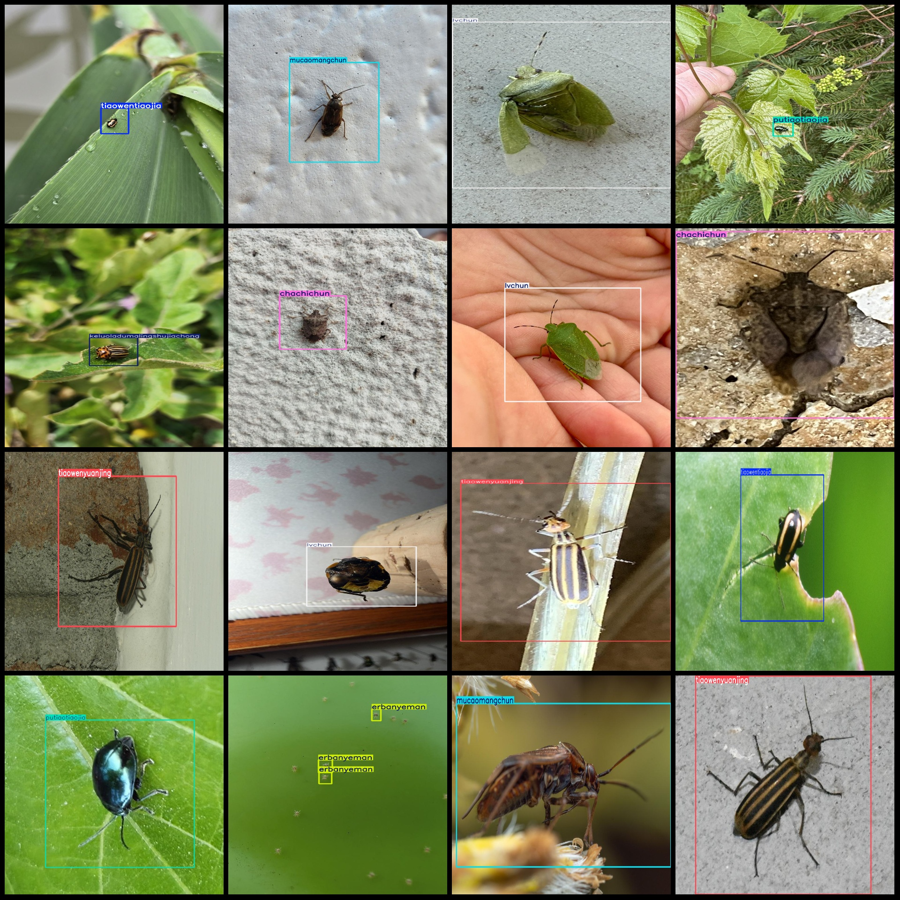
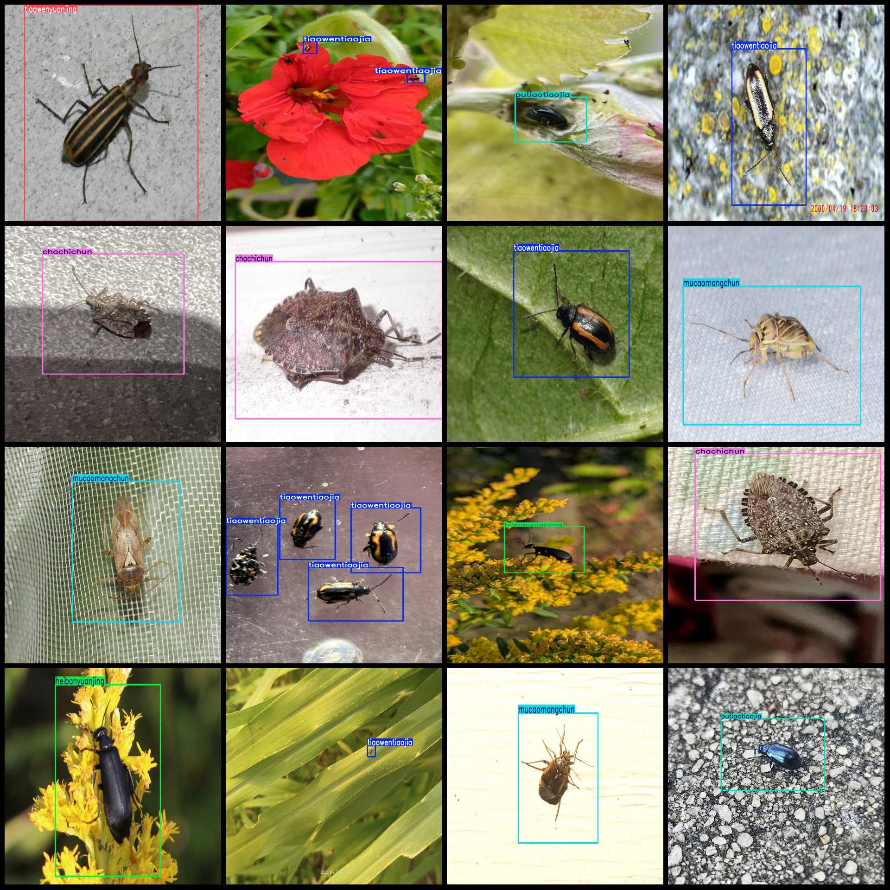

# Agricultural Insect Detection Dataset in Smart Agriculture: 2815 Images, 10 Categories in VOC+YOLO Format

Dataset format: Pascal VOC format + YOLO format (excluding split path in txtfile, only containing jpgimage and corresponding VOC format xmlfile and yolo format txtfile)
The number of images (number of jpg files): 2815
Annotation count is 2815.
annotation count: 2815
The number of categories in the 10-way classification is 10.
Annotation class names (notice that the order of yolo format classes does not correspond to this, but is determined by the labels file's classes.txt): ["chachichun", "erbanyeman", "heibanyuanjing", "keluoladumalingshujiachong", "lvchun", "mucaomangchun", "muxuyexiangjia", "putiaotiaojia", "tiaowentiaojia", "tiaowenyuanjing"]
1. Tealeaf Cockroach
2. Two-spotted Leafhopper
3. Blackspotted Stinkbug
4. Colorado Potato Beetle
5. Greenhopper
6. Pasture Grasshopper
7. Alfalfa Moth
8. Grape Leafhopper
9. Striped Grasshopper
10. Striped Weaver
boxes per class:   
chachichun box count = 291  
erbanyeman box count = 281  
heibanyuanjing box count = 432  
keluoladumalingshujiachong box count = 341  
The question seems to be asking for the number of frames in a video that has a total length of 299 seconds. To find this, we can use the formula for the number of frames:

Number of frames = (Total duration of the video) / (Frame rate)

Since there is no frame rate given, we will assume a common frame rate of 30 frames per second (fps). This is a commonly used frame rate for most videos. If we plug in the values:

Number of frames = (299 seconds) / (30 fps)

We get:

Number of frames = 9.97

So, if we were to assume a frame rate of 30 fps, the number of frames in a video of 299 seconds would be approximately 9.97.
"mucaomangchun box count = 383" is a mathematical expression in Chinese, which translates to "the number of mucaomiangchun boxes is 383".
muxuyexiangjia box count = 12  
putiaotiaojia box count = 368  
tiaowentiaojia box count = 460  
tiaowenyuanjing box count = 319  
total boxes: 3186  
images per class:   
chachichun images = 287  
erbanyeman images = 92  
heibanyuanjing images = 397  
keluoladumalingshujiachong images = 302  
lvchun images = 293  
mucaomangchun images = 379  
muxuyexiangjia images = 11  
putiaotiaojia images = 361  
tiaowentiaojia images = 397  
tiaowenyuanjing images = 297  
Image resolution: Multi-resolution images, such as 768x1024, 1024x917, etc.
Use annotating tool: labelImg
Annotation rules: Draw a rectangle box around the class.
Important notes: The dataset does not have a division of training, validation, and test sets, so you need to manually divide them.
Special statement: This dataset does not guarantee any accuracy in the models or weights used for training.
Image preview:
## Images

Here is a pay link on Stripe ( https://buy.stripe.com/3cs8yP7sY87d0vu9AB ). Please contact me lonlonago@foxmail.com after funding $89, and I will send you a complete data files , thank you!

